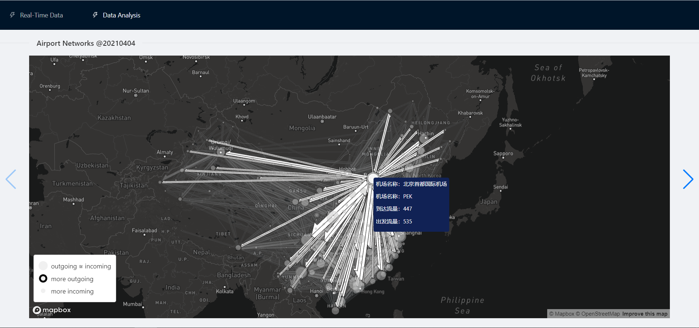
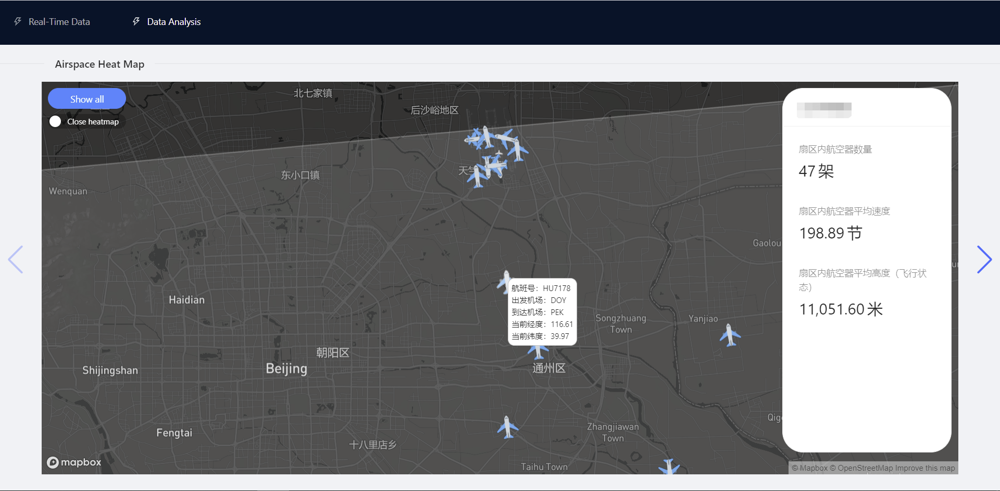

## Course Project
Aviation data visualization and analysis

### Quick setup
```
docker-compose up
```

### Results
**Real-time flights status visualization:**


**Air traffic network visualization:**


**Airspace flights visualization:**


### LICENSE
MIT License see [`LICENSE`](./LICENSE).